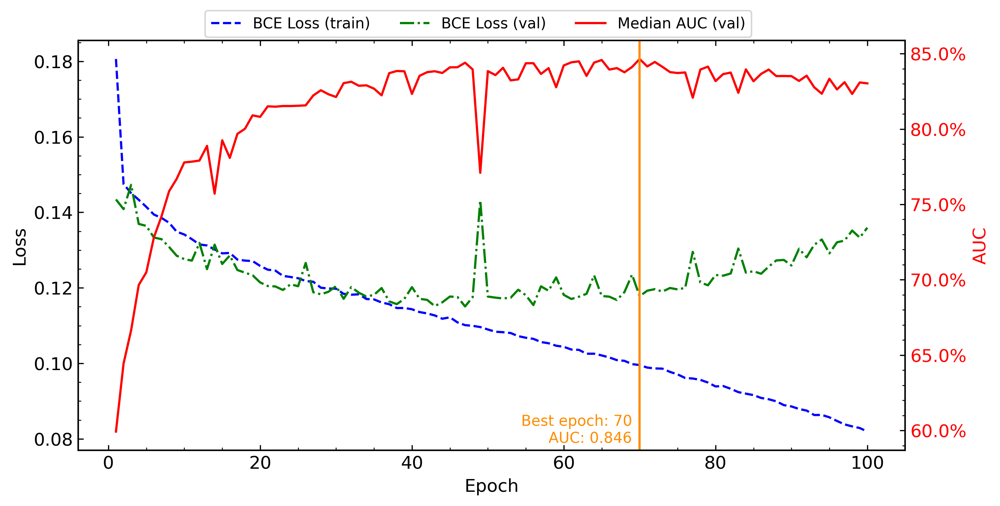
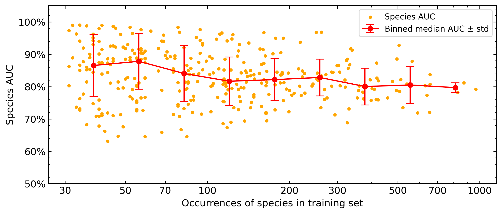

# Species distribution modeling with multimodal satellite and environmental data

*Project as part of the ENV-540 (Image Processing for Earth Observation) EPFL course*

by Moea Geffard, Aurélien Genin, and Katia Todorov

The goal of the project is to define a deep learning model to predict the absence/presence of 342 plant species in different areas using as inputs:
* Sentinel-2 RGB image patches;
* Quarterly Landsat time series spanning 10 years for four spectral bands (RGB+NIR);
* 19 tabular climatic variables.

Our base model architecture uses a processing pipeline for each modality:
* [Satlas](https://github.com/allenai/satlaspretrain_models/tree/main) CNN for Sentinel-2 images + MLP head giving a 256-features vector;
* CNN for timeseries + MLP head giving a 64-features vector;
* MLP for climatic variables giving a 128-features vector.

The resulting features are then concatenated and fed in a MLP to return a final 342 dimensions absence/presence vector.

| Model variation | Size [MB] | Training time [min] | Median AUC $\pm$ std | F1 (micro) | F1 (macro) |
| :-: | :-: | :-: | :-: | :-: | :-: |
| Base | 108.8 | 33.05 | 0.831 $\pm$ 0.079 | 0.186 | 0.098 |
| Satlas (SwinB) | 346.4 | 51.42 | 0.828 $\pm$ 0.079 | 0.183 | 0.091 |
| Timeseries (larger kernel) |  |  |  $\pm$  |  |  |
| Timeseries (MLP) |  |  |  $\pm$  |  |  |
| Env (larger) |  |  |  $\pm$  |  |  |
| Double features | 110.7 | 32.18 | 0.828 $\pm$ 0.078 | 0.147 | 0.072 |
| Equal features |  |  |  $\pm$  |  |  |